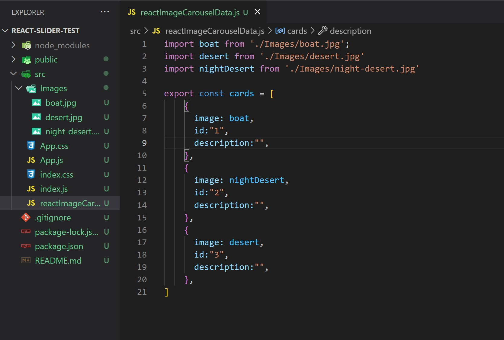
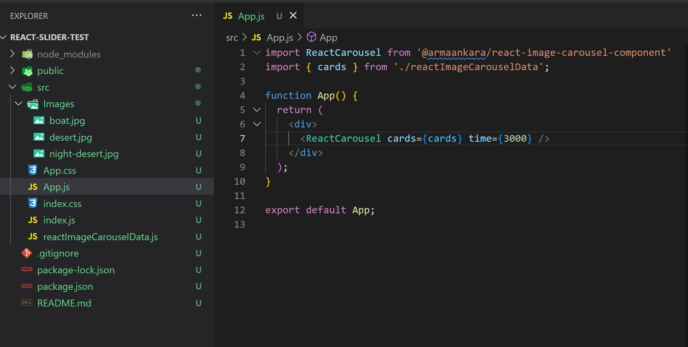

# What is the React Image Carousel Component?

It is a lightweight 3 image carousel. It displays three images and rotates through them every 5 seconds and also has the ability to manually navigate through the images with the arrow buttons.

***Note - This component has it's own CSS and it is recommended that you place the component in an area where not a lot of CSS will be acting on it as it could hinder its effect. This is a standalone component that does not need additionally CSS unless of course you want to alter it in some way then expect the image carousel to not act in the way it was designed***

    </img>

## How to use the React Image Carousel?

### Installation:
Run the bolded text here your terminal of your project **npm i @armaankara/react-image-carousel-component** 

Run this in your command line. If you want to double check that the package was installed go to your package.json and look for it in dependencies there.

### File Set Up:
To do this it is recommended that you create somewhere in your SRC folder of your React application a javascript file titled reactImageCarouselData.js (filename can be anything you like this is just an example) and an Images folder with your three desired images (right now support is only for three images). 

Once data file (reactImageCarouselData.js) is created this is how you should structure the file contents (This is an example React app made with create-react-app).

As you can see at the top of the file (reactImageCarouselData.js) we have the three images imported into the file from the Images folder in the SRC. 
Then we create and export the variable cards (you can call it whatever you like, this is just an example) and set it equal to an array with three objects.
Inside each object we have two key, value pairs. The image key is set to the image name from the imported images above and then and id key set to a string with a number inside of it. Set up your image data file like this.

### Calling the Component

In any file that you want to call the image carousel component you will want to call it like the image below:

1) import ReactCarousel from '@armaankara/react-image-carousel-component'
2) import { cards } from './relative-path-where-image-data-is-stored'
3) In your function call < ReactCarousel cards={cards} >

Explanation of cards={cards}:
cards={} comes from the Image Carousel Component so that will never change. What will change is what is inside the curly braces here. This value is what was imported from the image data file created earlier the variable cards in that file is what was exported and now called in the curly braces here. This is important to note as you can have as many image carousels in your application as you like you will just need to create more image data files.

### Summary:
- Install the component: **npm i @armaankara/react-image-carousel-component** 
- Create an image folder in your src folder of React application
- Create and export a variable (cards) and set it equal to an array with three objects with two key, value pairs --> image: imageName and id: "a number between 1 to 3"
- Call component in the file of your choice by:
    1) import ReactCarousel from '@armaankara/react-image-carousel-component'
    2) import {cards} from './iamge-data.js'
    3) Call component ReactCarousel in function with cards={cards}

Thank you I hope you enjoy the component and put it to good use!

